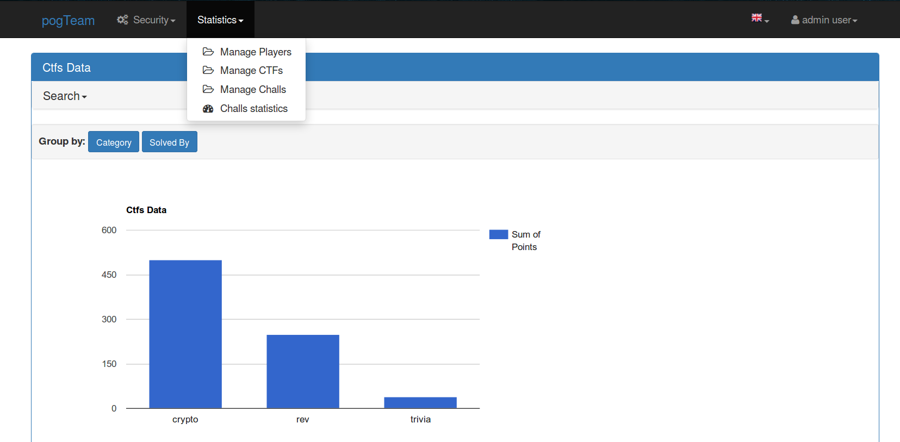

This is the pogTeam's CTFs records system. Here we manage our progress, checking which categories we are best and which we are worse. We also have an individual progress index.

This project uses flask_appbuilder and quickcharts2 as its base.

# Installation
We recommend using a virtualenv for this project. First install the dependencies:

    $ pip install -r requirements.txt
    
Rename your *config.py.example* to *config.py* and edit it.

# Run

Create an Admin user:

    $ fabmanager create-admin

Run it:

    $ fabmanager run
